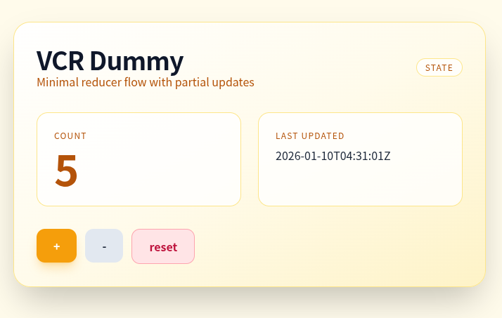

# view_component_reducible

[](https://deepwiki.com/manabeai/view_component_reducible)



This sample shows state transitions and partial updates powered entirely by ViewComponent.
The only thing you add in Rails is a single endpoint:

```rb
mount ViewComponentReducible::Engine, at: "/vcr"
```

Everything else is **reducible** to ViewComponent—no extra endpoints, controllers, WebSockets, or JS frameworks required.

view_component_reducible brings reducer-based state transitions
to Rails ViewComponent, inspired by TEA (The Elm Architecture).

## Quick Start

### 1. Install

```rb
# Gemfile
gem "view_component_reducible"
```

```sh
bundle install
```

### 2. Mount the endpoint

```rb
# config/routes.rb
mount ViewComponentReducible::Engine, at: "/vcr"
```

### 3. Configure adapter

```rb
# config/initializers/view_component_reducible.rb
ViewComponentReducible.configure do |config|
  config.adapter = ViewComponentReducible::Adapter::HiddenField
  config.secret = Rails.application.secret_key_base
end
```

Including `ViewComponentReducible::Component` registers the component automatically.

### 4. Create component

```rb
# app/components/counter_component.rb
class CounterComponent < ViewComponent::Base
  include ViewComponentReducible::Component

  state do
    field :count, default: 0
  end

  def reduce(state, msg)
    case msg
    in { type: :increment }
      state.with(count: state.count + 1)
    else
      state
    end
  end
end
```

```erb
<!-- app/components/counter_component.html.erb -->
<section>
  <p><%= vcr_state.count %></p>
  <%= vcr_button_to("+", type: :increment) %>
</section>
```

### 5. Enable partial updates

```erb
<!-- app/views/layouts/application.html.erb -->
<%= vcr_dispatch_script_tag %>
```
